<div style="position: relative; text-align: center; color: white;">
  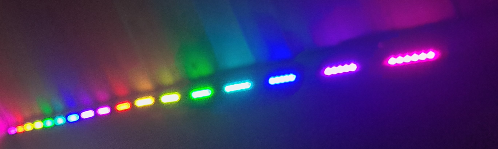
  <h1 style="position: absolute; top: 50%; left: 50%; transform: translate(-50%, -50%); font-size: 6rem; text-shadow: 2px 2px 4px rgba(0, 0, 0, 0.7);">
    LED STRIP
  </h1>
</div>


## Présentation du Projet

Le projet consiste à contrôler une bande LED en utilisant une interface utilisateur sur un navigateur web. 
L’interface permet :

1. L’allumage ou l’extinction des LED.

2. La modification de paramètres tels que la luminosité, la vitesse, et les couleurs.

3. La sélection de modes statiques ou dynamiques pour des effets lumineux variés (par exemple, mode arc-en-ciel, une ou plusieurs couleurs fixes, etc.).


## Release

### **v1.0.0** (Stable)

#### Fonctionnalités
- **Interface Web** : Contrôle du bandeau LED via une interface accessible depuis un navigateur.
  - Activer/désactiver les LEDs.
  - Régler la luminosité, la vitesse, et les couleurs.
  - Choisir entre des modes d'éclairage statiques ou dynamiques (ex. : Arc-en-ciel, Couleurs statiques, etc.).
- **Compatibilité Matérielle** :
  - Support du NodeMCU ESP8266 V3 avec connectivité WiFi.
- **Configuration** :
  - Configuration d'une IP statique pour un accès local simplifié.
  - Mode point d'accès (AP) en cas de fonctionnement autonome.
- **Bibliothèques Utilisées** :
  - FastLED, LittleFS, ESP8266WiFi, ESPAsyncTCP, ESPAsyncWebServer.

### **v2.0.0** (En cours de développement)
#### Objectifs 
- **Correction de Bugs** :
  - Résolution des problèmes affectant la stabilité et les performances.

- **Nouvelle Interface Utilisateur** :
  - Interface entièrement repensée, plus intuitive et moderne.
  - Navigation simplifiée et meilleure accessibilité des fonctionnalités.

- **Amélioration de la Communication Serveur** :
  - Intégration d’une nouvelle API avec des endpoints optimisés :
    - Endpoints supplémentaires pour un contrôle avancé des paramètres (POST, GET, etc.).
  - Réduction de la latence pour les mises à jour live.

- **Application Mobile** :
  - Développement d’une application mobile dédiée.

#### En cours 
- **Refacto de l'architecture :**
  - POO
  - Implémentation de route supplémentaires 
  - Implémentation de Websockets

- **Refacto de l'interface**
  - Preact

#### A Faire
        
- [Interface] Factoriser les composants
- [Interface] Creer des coulaur dans le dashboard
- [Arduino] Persister les couleurs, et les configuration : luminosité, vitesse, ordre ... 

- [Arduino] Nouveau schéma static (palette)
- [Arduino] Nouveau schéma dynamique (back-foward, rainbow, dynamique palette)

- [Arduino] Prendre en compte le blur
- [Arduino] Prendre en compte l'offset
- [Arduino] Prendre en compte le spread

- [API & Interface] Modification de la blur, offset, spread, speed, brightness
- [API] Envoyer des valeurs pertinante a travers le websocket (state, order...)
- [Interface] Mettre a jours automatiquement en récuperant les valeurs via le websocket

- [Arduino & API & Interface] Edition d'une couleurs
- [Arduino & API & Interface] Suppression d'une couleurs
- [Mobile] App mobile


## Hardware

  1. Microcontrolleur / Carte réseaux (WIFI)

    NodeMCU ESP8266 V3 4Mb 

      - Puissance de transmission WiFi : 25 dBm
      - Alimentation : 5 V (10 V max)
      - Tension d'alimentation : 3,3 V (NIVEAU LOGIQUE : 3,3 V)
      - Bande : 2400 (MHz)
      - Protocoles pris en charge : 802.11 b/g/n


  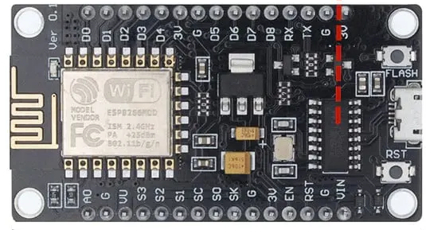

  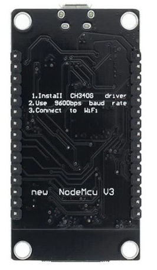

  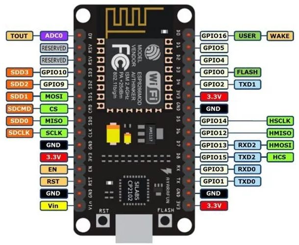

  2. Bande LED

  [Bandeau de Led](https://arduinofactory.fr/bandeau-de-led/)

  Exemple de projet avec alimentation externe

  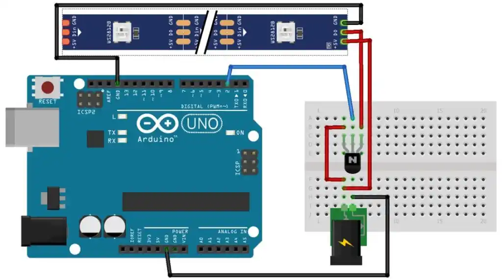

## Instalation

###  Installation du driver CH340

[How to Install CH340 Driver on Windows](https://electropeak.com/learn/how-to-install-ch340-driver/?srsltid=AfmBOooDakEbqzjJcx21P1R1RKHhBpM1cOd9DOg_VaHFVGclPnMmj2I6)

[CH340 Drivers for Windows, Mac and Linux](https://sparks.gogo.co.nz/ch340.html?srsltid=AfmBOor-SQ8Wkt_hKxAiTvu2GNO3Ntjkz0wxnwUpDYSyHhbdA3K1yczv)

1. Télécharger le driver [CH34x_Install_Windows_v3_4](./resource/image/CH34x_Install_Windows_v3_4.zip)

2. Déziper

3. Installer le driver

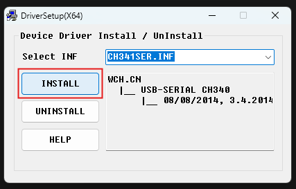

4. vérification de l'instalation du driver et connexion au port COM correpondant

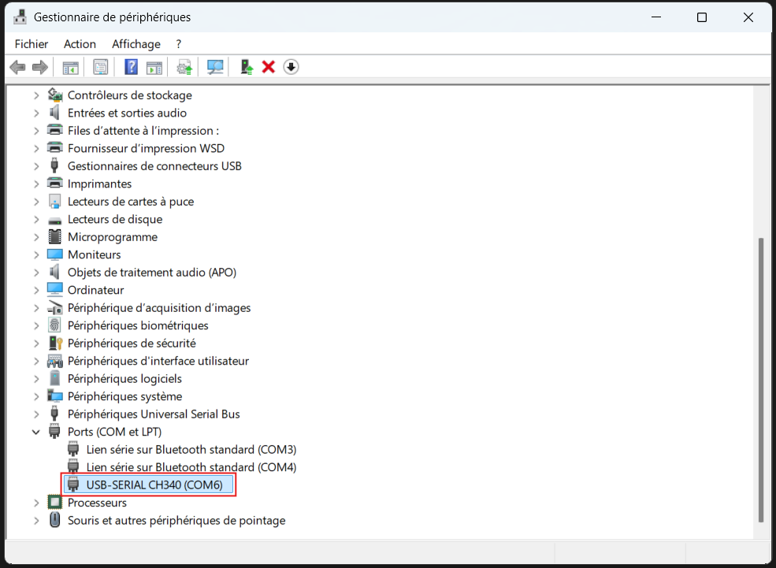


###  Support du microcontrontrelleur ep8266

1. Ouvrir les préférence dans l'IDE Arduino 

2. Dans le champ URL de gestionnaire de cartes supplémentaire, saisir l’adresse suivante :

https://arduino.esp8266.com/stable/package_esp8266com_index.json

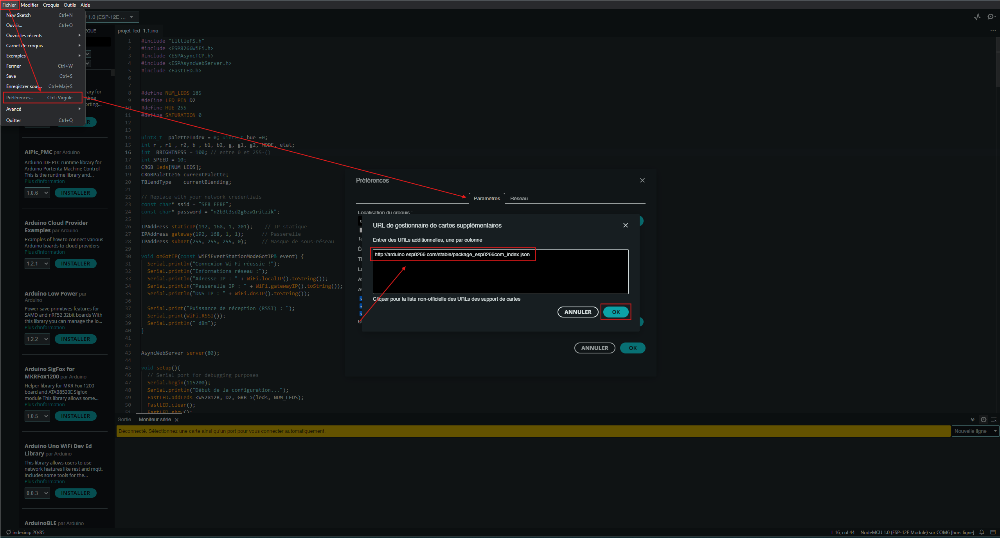

3. Ouvrir le gestionnaire de carte

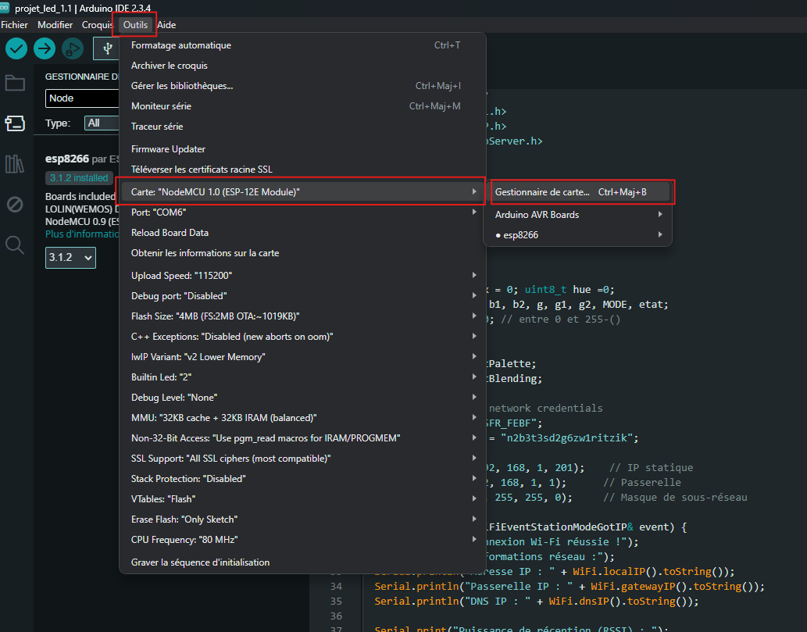

4. Installer le gestionnaire corrspondant à l'ESP8266

Nom du gestionanire : esp8266
Développé par : ESP8266 Community
Verison : 3.1.2 (lts 25/05/2025)

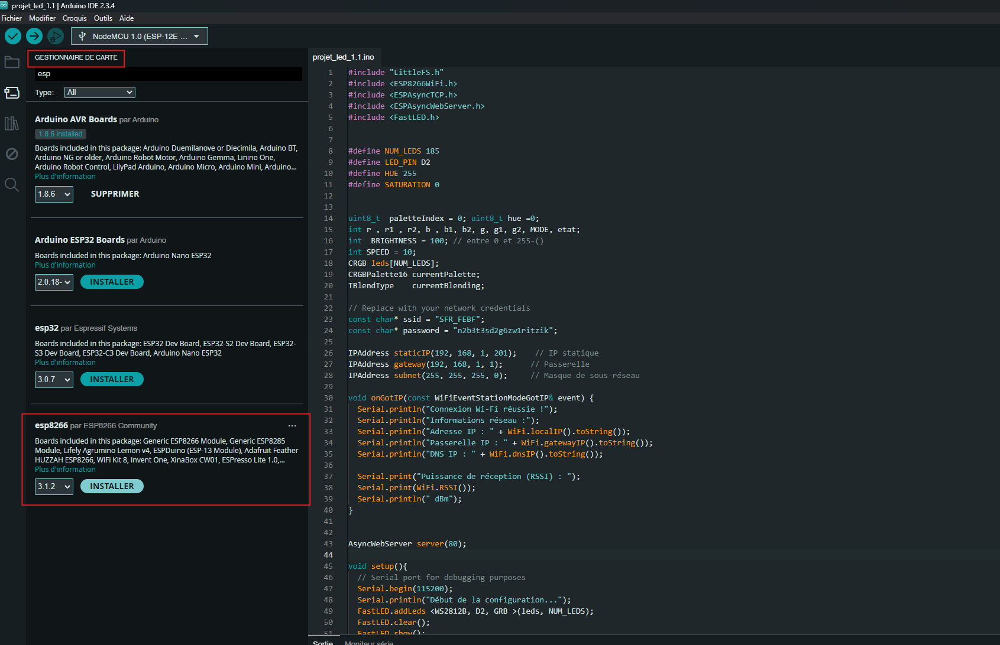

5. Sélectionner la carte 

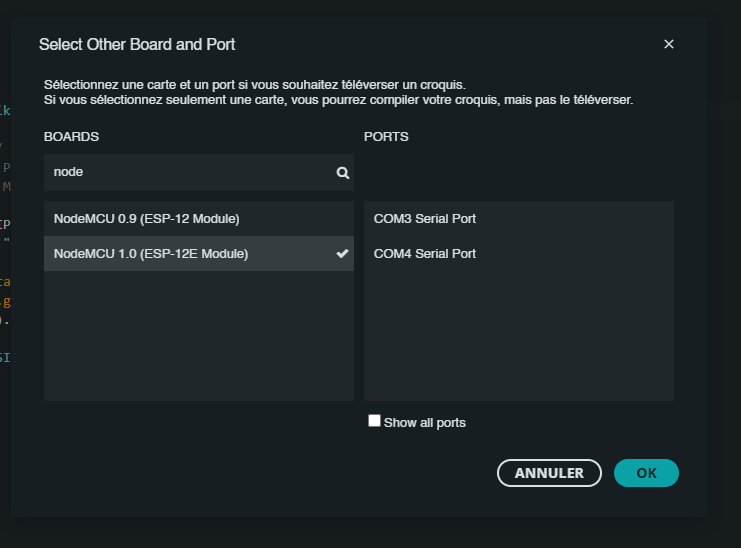


###  Installation de LittleFS Filesystem Uploader

Nom du plugin : arduino-littlefs-upload
Développé par : Earle F. Philhower
Verison : 1.5.4 (lts 11/06/2025)

[Install ESP8266 NodeMCU LittleFS Filesystem Uploader in Arduino IDE](https://randomnerdtutorials.com/install-esp8266-nodemcu-littlefs-arduino/#installing)

[Arduino IDE 2: Install ESP8266 NodeMCU LittleFS Uploader (Upload Files to the Filesystem)](https://randomnerdtutorials.com/arduino-ide-2-install-esp8266-littlefs/)

1. Télécharger le paquet au format .vsix dans le repository Github

[Github - Arduino littlefs upload](https://github.com/earlephilhower/arduino-littlefs-upload)

[Github - Arduino littlefs upload - Release 1.5.4](https://github.com/earlephilhower/arduino-littlefs-upload/releases)

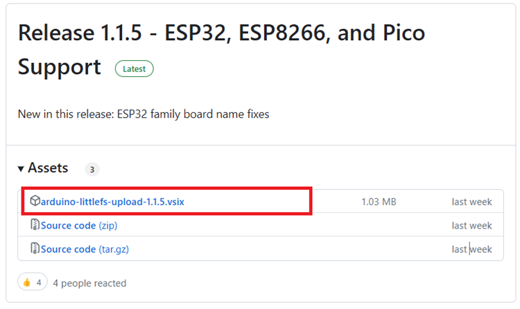

2. Créer un dossier `plugin` si il n'existe pas déjà dans `C:\Users\<username>\.arduinoIDE\`


3. Déplacer le paquet télécharger précedement dans `C:\Users\<username>\.arduinoIDE\plugins`

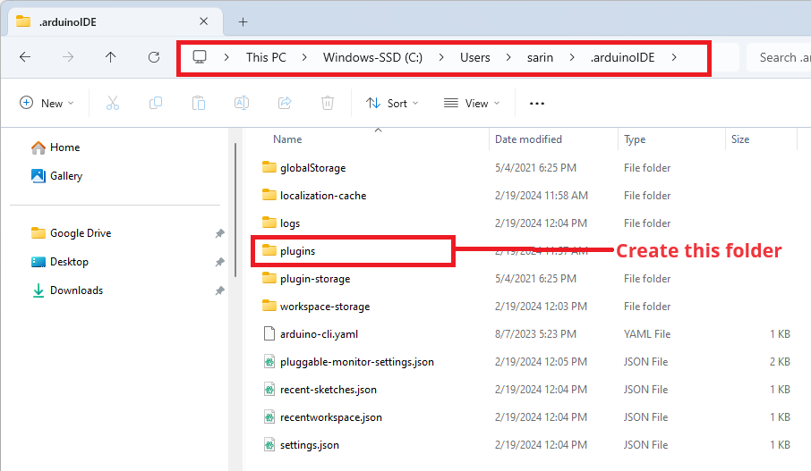

4) Redémarer l'IDE Arduino et verifier si le plugin c'est bien installer nouvelle instruction dans le panneau de commande ([Ctrl] + [Shift] + [P]), chercher `Upload LittleFS`.

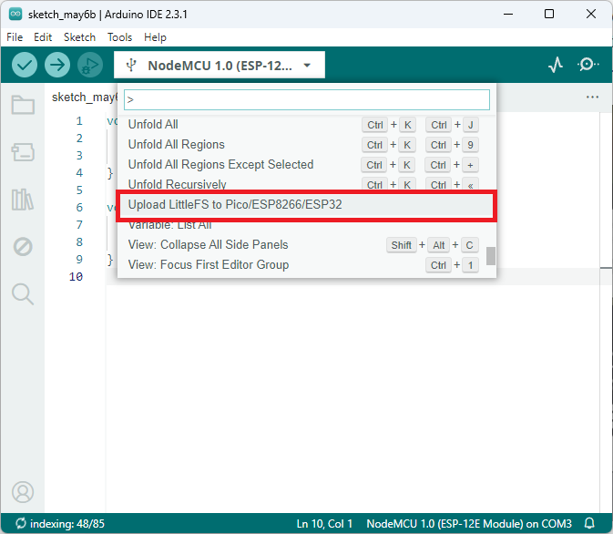


### Utilisation de littlFS 

1. Au meme niveau que le fichier .ino ajouter un dossier data contenant l'ensmble des données 
2. Configurer la memoire flash
3. Fermer le moniteur serie

[ESP8266 Community Forum](https://github.com/esp8266)

[Welcome to ESP8266 Arduino Core’s documentation!](https://arduino-esp8266.readthedocs.io/en/latest/index.html)


### Librairie

#include <vector>
#include <optional>
#include <functional>

#include <Arduino.h>
#include <FastLED.h>
#include <LittleFS.h>
#include <AsyncJson.h>
#include <ESP8266WiFi.h>
#include <ArduinoJson.h>
#include <ESPAsyncTCP.h>
#include <ESPAsyncWebServer.h>

#### FastLED

Nom de la bibliotheque : ArduinoJson
Développé par : Benoit Blanchon 
Verison : 7.4.1 (lts 25/05/2025)

[Github FastLED](https://github.com/FastLED/FastLED)

[FastLED Animation Library](https://fastled.io/)

[FastLED Library](https://fastled.io/docs/)

#### LittleFS

https://arduino-esp8266.readthedocs.io/en/latest/filesystem.html


Nom de la bibliotheque : ESPAsyncWebServer
Développé par : Lacamera
Verison : 3.1.0 (lts 25/05/2025)

#### ESP8266WiFi

[ESP8266WiFi](https://arduino-esp8266.readthedocs.io/en/latest/esp8266wifi/readme.html)

Nom de la bibliotheque : 
Développé par : 
Verison : 

#### ESPAsyncTCP

Nom de la bibliotheque : ESPAsyncTCP
Développé par : Dvarrel
Verison : 1.1.4 (lts 25/05/2025)

#### ESPAsyncWebServer

Nom de la bibliotheque : ESPAsyncWebServer
Développé par : Lacamera
Verison : 3.1.0 (lts 25/05/2025)

#### ArduinoJson

Nom de la bibliotheque : ArduinoJson
Développé par : Benoit Blanchon 
Verison : 7.4.1 (lts 25/05/2025)


## Configuration

### V1

  #### Paramètres LED
  - **Nombre de LED** : `NUM_LEDS = 185`
  - **Broche de contrôle des LED** : `LED_PIN = D2 (GPIO4)`

  #### Paramètres Réseau WiFi
  - **Nom du réseau WiFi (SSID)** : `SFR_2012`
  - **Mot de passe** : `ChangeMe`

  #### Configuration Réseau
  - **Adresse IP statique** : `IPAddress staticIP(192, 168, 1, 201)`
  - **Passerelle** : `IPAddress gateway(192, 168, 1, 1)`
  - **Masque de sous-réseau** : `IPAddress subnet(255, 255, 255, 0)`

  #### Serveur Web
  - **Port du serveur Web** : `AsyncWebServer server(80)`

### V2 

  #### Paramètres LED
  - **Broche de contrôle des LED** : `D2 (GPIO4)`
  
  #### Serveur Web
  - **HTTP** : http://<IP>:80
  - **Websocket** : ws://<IP>:80/ws

  #### Fichier de configuration


  - **Sur la base du fichier de configuration en exemple `config.exemple.h` configurer sont environnement**

  ```cpp
  // ./configs/config.exemple.h

  #ifndef CONFIG_H
  #define CONFIG_H

  const char *ENVIRONMENT = "exemple";
  const char *WIFI_SSID = "Free";
  const char *WIFI_PASSWORD = "changeme";

  uint8_t IP[4] = {192, 168, 0, 2};
  uint8_t GATEWAY[4] = {192, 168, 0, 1};
  uint8_t SUBNET[4] = {255, 255, 255, 0};

  const int NUM_LEDS = 30;
  const float SPEED = 1.0f;

  #endif
  ```
  1. Creation du  fichier `./configs/config.<mon_env>.h`
  2. Modifier les valeurs 

  ```cpp
  // ./configs/config.<mon_env>.h
  
  #ifndef CONFIG_H
  #define CONFIG_H

  const char *ENVIRONMENT = <mon_env>;
  ...

  #endif
  ```

  - **Importer le fichier dans le fichier : <mon_projet>.ino**
  
  ```arduino
  #include "./configs/config.<mon_env>.h"
  ```


## Structure

### Controle des LED

Le contrôle des LED repose sur l'utilisation de la bibliothèque **FastLED** qui permet de gérer des effets lumineux complexes et d'interagir directement avec la bande LED.

1. **Initialisation des LED** :
   - Le code initialise la bande LED en spécifiant le nombre total de LED et la broche utilisée.
   - Exemple :
     ```cpp
     #define LED_PIN 2 // D2 (GPIO4)
     #define NUM_LEDS 185
     CRGB leds[NUM_LEDS];

     void setup() {
         FastLED.addLeds<WS2812, LED_PIN, GRB>(leds, NUM_LEDS);
         FastLED.clear();
         FastLED.show();
     }
     ```

2. **Gestion des Effets** :
   - Les effets lumineux sont programmés comme des fonctions, par exemple :
     - **Effet Arc-en-ciel** :
       ```cpp
       void rainbow() {
           fill_rainbow(leds, NUM_LEDS, millis() / 10, 255 / NUM_LEDS);
           FastLED.show();
       }
       ```

   - Les modes sont sélectionnés via des requêtes HTTP envoyées depuis l'interface web.

3. **Mise à Jour Dynamique** :
   - Les paramètres de luminosité, vitesse, ou couleur sont reçus via les requêtes HTTP et appliqués en temps réel :
     ```cpp
     FastLED.setBrightness(brightness);
     FastLED.show();
     ```

### Serveur Web

Le serveur Web est implémenté à l’aide des bibliothèques **ESPAsyncWebServer** et **ESPAsyncTCP**, permettant une gestion asynchrone et fluide des requêtes HTTP.

1. **Initialisation** :
    - Le serveur écoute sur le port 80 par défaut.
    - Exemple :

      ```cpp
      AsyncWebServer server(80);
      void setup() {
          server.begin();
      }
      ```

2. **End point**
    - Configuration de point d'accèes au datas 
    - Exemple : 

      ```cpp
      server.on("/update", HTTP_GET, [] (AsyncWebServerRequest *request) {
        etat = (request->getParam("state")->value()).toInt();
        Serial.println(etat);
      request->send(200, "text/plain", "OK");
      });
      ```

### Interface

L'interface utilisateur repose sur HTML, CSS et JavaScript, et est servie directement depuis l'ESP8266 grâce au système de fichiers **LittleFS**.


### Connexion au Réseau Local
La connexion au réseau WiFi permet de contrôler les LED via une interface web.

1. **Connexion WiFi** :
   - Le code configure le SSID et le mot de passe dans le sketch Arduino :
     ```cpp
     const char* ssid = "SFR_2012";
     const char* password = "ChangeMe";

     void setupWiFi() {
         WiFi.begin(ssid, password);
         while (WiFi.status() != WL_CONNECTED) {
             delay(1000);
         }
     }
     ```

2. **Adresse IP Statique** :
   - Une adresse IP statique est définie pour garantir un accès facile au serveur :
     ```cpp
     IPAddress staticIP(192, 168, 1, 201);
     IPAddress gateway(192, 168, 1, 1);
     IPAddress subnet(255, 255, 255, 0);

     void setupWiFi() {
         WiFi.config(staticIP, gateway, subnet);
     }
     ```

3. **Validation de Connexion** :
   - Des indicateurs comme des LEDs sur l'ESP peuvent signaler l'état de connexion.


### Point d’Accès
Un point d'accès (AP) est utile si aucun réseau WiFi local n'est disponible.

1. **Création d’un Point WiFi** :
   - Le mode point d’accès est activé avec un SSID et un mot de passe :
     ```cpp
     void setupAP() {
         WiFi.softAP("LED_Controller", "12345678");
     }
     ```

2. **Attribution d’une IP au Point d’Accès** :
   - Une adresse IP est attribuée à l’ESP pour l’interface web :
     ```cpp
     IPAddress AP_IP(192, 168, 4, 1);
     WiFi.softAPConfig(AP_IP, AP_IP, IPAddress(255, 255, 255, 0));
     ```

3. **Redirection Automatique** :
   - Tous les clients connectés au point d’accès sont redirigés vers l’interface web.

4. **Basculement entre les Modes** :
   - Le système peut détecter l’absence de réseau local et basculer automatiquement en mode AP :
     ```cpp
     if (WiFi.status() != WL_CONNECTED) {
         setupAP();
     }
     ```

### Générer un apk

#### Installer bubblewrap

```
npm install -g @bubblewrap/cli        
```

```
bubblewrap init --manifest https://j-renevier.github.io/ledStrip/manifest.json

Web app details (1/5)

? Domain: j-renevier.github.io
? URL path: /

Android app details (2/5)

? Application name: LED Strip Controller
? Short name: LEDStrip
? Application ID: io.github.j_renevier.twa
? Starting version code for the new app version: 1
? Display mode: standalone
? Orientation: portrait
? Status bar color: #2563F4

Launcher icons and splash screen (3/5)

? Splash screen color: #FFFFFF
? Icon URL: https://j-renevier.github.io/ledStrip/pwa-512x512.png
? Maskable icon URL: https://j-renevier.github.io/ledStrip/pwa-512x512.png

Optional Features (4/5)

? Monochrome icon URL: https://j-renevier.github.io/ledStrip/pwa-512x512.png
? Include support for Play Billing (this relies on alpha dependencies)? No
? Request geolocation permission? No

Signing key information (5/5)

? Key store location: C:\Users\rapha\project\arduino\ledStrip\V2\interface\android.keystore
? Key name: android

An existing key store could not be found at "C:\Users\rapha\project\arduino\ledStrip\V2\interface\android.keystore".

? Do you want to create one now? Yes
? First and Last names (eg: John Doe): Joachim Renevier
? Organizational Unit (eg: Engineering Dept): kepler11
? Organization (eg: Company Name): kepler11
? Country (2 letter code): fr
? Password for the Key Store: 123456
? Password for the Key: 123456
keytool Signing Key created successfully

Project generated successfully. Build it by running bubblewrap build
```

### Verifier en live sur mobile 

```sh
adb kill-server
```

```sh
adb start-server                     
* daemon not running; starting now at tcp:5037
* daemon started successfully
```

```sh
adb devices                      
List of devices attached
T5CX707569MT     device
```

```sh 
adb pair 192.168.1.145:39443
Enter pairing code: 186790
Successfully paired to 192.168.1.102:145 [guid=adb-R5CX70018MT-dawdsU]
```

```sh 
adb connect 192.168.1.145:44955
connected to 192.168.1.145:44955
```

```sh 
adb reverse tcp:5173 tcp:5173
```

### Routes V1

**[DOC API](./swagger.yml/)**

| Endpoint    | Méthode | Description                                | Exemple                                           |
|-------------|---------|--------------------------------------------|---------------------------------------------------|
| `/update`   | GET     | Permet d'activer ou désactiver les LEDs.   | `/update?state=on`                               |
| `/slider1`  | GET     | Ajuste la luminosité.                      | `/slider1?value=128`                             |
| `/slider2`  | GET     | Définit la vitesse des animations.         | `/slider2?value=50`                              |
| `/slider3` à   `/slider5` | GET     | Définit les couleurs.         | `/slider3?value=50`                              |
| `/select`   | GET     | Sélectionne un mode d’éclairage.           | `/select?mode=1`                           |


- Index : 

  host/

- Style : 

  host/style.css

- Script :

  host/script.js

- Favicon : 
  
  host/image.png

- Configurer l'etat des LED 

  GET host/update?state=(bool state)

  Allumer : GET host/update?state=1
  Eteindre : GET host/update?state=0

- Configurer la luminosité

  GET host/slider1?value=(int brightness)

- Configurer la vitesse 

  GET host/slider2?value=(int speed)

- Configurer le mode d'éclairage

  GET host/select?value=(int selectedMode)

- Configurer la couleur 1 

  GET host/slider3?value=(int color1)

- Configurer la couleur 2

  GET host/slider4?value=(int color2)

- Configurer la couleur 3

  GET host/slider5?value=(int color3)


