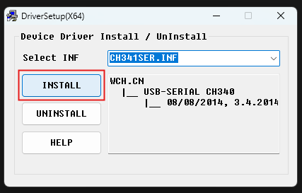

<div style="position: relative; text-align: center; color: white;">
  
  <h1 style="position: absolute; top: 50%; left: 50%; transform: translate(-50%, -50%); font-size: 6rem; text-shadow: 2px 2px 4px rgba(0, 0, 0, 0.7);">
    LED STRIP
  </h1>
</div>


## Présentation du Projet

Le projet consiste à contrôler une bande LED en utilisant une interface utilisateur sur un navigateur web. 
L’interface permet :

1. L’allumage ou l’extinction des LED.

2. La modification de paramètres tels que la luminosité, la vitesse, et les couleurs.

3. La sélection de modes statiques ou dynamiques pour des effets lumineux variés (par exemple, mode arc-en-ciel, une ou plusieurs couleurs fixes, etc.).


## Release

### **v1.0.0** (Stable)

#### Fonctionnalités
- **Interface Web** : Contrôle du bandeau LED via une interface accessible depuis un navigateur.
  - Activer/désactiver les LEDs.
  - Régler la luminosité, la vitesse, et les couleurs.
  - Choisir entre des modes d'éclairage statiques ou dynamiques (ex. : Arc-en-ciel, Couleurs statiques, etc.).
- **Compatibilité Matérielle** :
  - Support du NodeMCU ESP8266 V3 avec connectivité WiFi.
- **Configuration** :
  - Configuration d'une IP statique pour un accès local simplifié.
  - Mode point d'accès (AP) en cas de fonctionnement autonome.
- **Bibliothèques Utilisées** :
  - FastLED, LittleFS, ESP8266WiFi, ESPAsyncTCP, ESPAsyncWebServer.

### **v2.0.0** (En cours de développement)
#### Nouveautés et Améliorations
- **Correction de Bugs** :
  - Résolution des problèmes affectant la stabilité et les performances.

- **Nouvelle Interface Utilisateur** :
  - Interface entièrement repensée, plus intuitive et moderne.
  - Navigation simplifiée et meilleure accessibilité des fonctionnalités.

- **Amélioration de la Communication Serveur** :
  - Intégration d’une nouvelle API avec des endpoints optimisés :
    - Endpoints supplémentaires pour un contrôle avancé des paramètres (POST, GET, etc.).
  - Réduction de la latence pour les mises à jour live.

- **Application Mobile** :
  - Développement d’une application mobile dédiée.


## Hardware

  1. Microcontrolleur / Carte réseaux (WIFI)

    NodeMCU ESP8266 V3 4Mb 

      - Puissance de transmission WiFi : 25 dBm
      - Alimentation : 5 V (10 V max)
      - Tension d'alimentation : 3,3 V (NIVEAU LOGIQUE : 3,3 V)
      - Bande : 2400 (MHz)
      - Protocoles pris en charge : 802.11 b/g/n


  

  

  

  2. Bande LED

  [Bandeau de Led](https://arduinofactory.fr/bandeau-de-led/)

  Exemple de projet avec alimentation externe

  

## Instalation

###  Installation du driver CH340

[How to Install CH340 Driver on Windows](https://electropeak.com/learn/how-to-install-ch340-driver/?srsltid=AfmBOooDakEbqzjJcx21P1R1RKHhBpM1cOd9DOg_VaHFVGclPnMmj2I6)

[CH340 Drivers for Windows, Mac and Linux](https://sparks.gogo.co.nz/ch340.html?srsltid=AfmBOor-SQ8Wkt_hKxAiTvu2GNO3Ntjkz0wxnwUpDYSyHhbdA3K1yczv)

1. Télécharger le driver [CH34x_Install_Windows_v3_4](./resource/image/CH34x_Install_Windows_v3_4.zip)

2. Déziper

3. Installer le driver



4. vérification de l'instalation du driver et connexion au port COM correpondant


###  Support du microcontrontrelleur ep8266

1. Ouvrir les préférence dans l'IDE Arduino 

2. Dans le champ URL de gestionnaire de cartes supplémentaire, saisir l’adresse suivante :

https://arduino.esp8266.com/stable/package_esp8266com_index.json


3. Ouvrir le gestionnaire de carte


4. Installer le gestionnaire corrspondant à l'ESP8266


5. Sélectionner la carte 


###  Installation de LittleFS Filesystem Uploader

[Install ESP8266 NodeMCU LittleFS Filesystem Uploader in Arduino IDE](https://randomnerdtutorials.com/install-esp8266-nodemcu-littlefs-arduino/#installing)

[Arduino littlefs upload](https://github.com/earlephilhower/arduino-littlefs-upload)

[ESP8266 Community Forum](https://github.com/esp8266)

[Welcome to ESP8266 Arduino Core’s documentation!](https://arduino-esp8266.readthedocs.io/en/latest/index.html)


### Librairie

#### FastLED

[Github FastLED](https://github.com/FastLED/FastLED)

[FastLED Animation Library](https://fastled.io/)

[FastLED Library](https://fastled.io/docs/)

#### LittleFS

#### ESP8266WiFi

#### ESPAsyncTCP

#### ESPAsyncWebServer

## Configuration 

### Paramètres LED
- **Nombre de LED** : `NUM_LEDS = 185`
- **Broche de contrôle des LED** : `LED_PIN = D2 (GPIO4)`

### Paramètres Réseau WiFi
- **Nom du réseau WiFi (SSID)** : `SFR_2012`
- **Mot de passe** : `ChangeMe`

### Configuration Réseau
- **Adresse IP statique** : `IPAddress staticIP(192, 168, 1, 201)`
- **Passerelle** : `IPAddress gateway(192, 168, 1, 1)`
- **Masque de sous-réseau** : `IPAddress subnet(255, 255, 255, 0)`

### Serveur Web
- **Port du serveur Web** : `AsyncWebServer server(80)`


## Structure

### Controle des LED

Le contrôle des LED repose sur l'utilisation de la bibliothèque **FastLED** qui permet de gérer des effets lumineux complexes et d'interagir directement avec la bande LED.

1. **Initialisation des LED** :
   - Le code initialise la bande LED en spécifiant le nombre total de LED et la broche utilisée.
   - Exemple :
     ```cpp
     #define LED_PIN 2 // D2 (GPIO4)
     #define NUM_LEDS 185
     CRGB leds[NUM_LEDS];

     void setup() {
         FastLED.addLeds<WS2812, LED_PIN, GRB>(leds, NUM_LEDS);
         FastLED.clear();
         FastLED.show();
     }
     ```

2. **Gestion des Effets** :
   - Les effets lumineux sont programmés comme des fonctions, par exemple :
     - **Effet Arc-en-ciel** :
       ```cpp
       void rainbow() {
           fill_rainbow(leds, NUM_LEDS, millis() / 10, 255 / NUM_LEDS);
           FastLED.show();
       }
       ```

   - Les modes sont sélectionnés via des requêtes HTTP envoyées depuis l'interface web.

3. **Mise à Jour Dynamique** :
   - Les paramètres de luminosité, vitesse, ou couleur sont reçus via les requêtes HTTP et appliqués en temps réel :
     ```cpp
     FastLED.setBrightness(brightness);
     FastLED.show();
     ```

### Serveur Web

Le serveur Web est implémenté à l’aide des bibliothèques **ESPAsyncWebServer** et **ESPAsyncTCP**, permettant une gestion asynchrone et fluide des requêtes HTTP.

1. **Initialisation** :
    - Le serveur écoute sur le port 80 par défaut.
    - Exemple :

      ```cpp
      AsyncWebServer server(80);
      void setup() {
          server.begin();
      }
      ```

2. **End point**
    - Configuration de point d'accèes au datas 
    - Exemple : 

      ```cpp
      server.on("/update", HTTP_GET, [] (AsyncWebServerRequest *request) {
        etat = (request->getParam("state")->value()).toInt();
        Serial.println(etat);
      request->send(200, "text/plain", "OK");
      });
      ```

### Interface

L'interface utilisateur repose sur HTML, CSS et JavaScript, et est servie directement depuis l'ESP8266 grâce au système de fichiers **LittleFS**.


### Connexion au Réseau Local
La connexion au réseau WiFi permet de contrôler les LED via une interface web.

1. **Connexion WiFi** :
   - Le code configure le SSID et le mot de passe dans le sketch Arduino :
     ```cpp
     const char* ssid = "SFR_2012";
     const char* password = "ChangeMe";

     void setupWiFi() {
         WiFi.begin(ssid, password);
         while (WiFi.status() != WL_CONNECTED) {
             delay(1000);
         }
     }
     ```

2. **Adresse IP Statique** :
   - Une adresse IP statique est définie pour garantir un accès facile au serveur :
     ```cpp
     IPAddress staticIP(192, 168, 1, 201);
     IPAddress gateway(192, 168, 1, 1);
     IPAddress subnet(255, 255, 255, 0);

     void setupWiFi() {
         WiFi.config(staticIP, gateway, subnet);
     }
     ```

3. **Validation de Connexion** :
   - Des indicateurs comme des LEDs sur l'ESP peuvent signaler l'état de connexion.


### Point d’Accès
Un point d'accès (AP) est utile si aucun réseau WiFi local n'est disponible.

1. **Création d’un Point WiFi** :
   - Le mode point d’accès est activé avec un SSID et un mot de passe :
     ```cpp
     void setupAP() {
         WiFi.softAP("LED_Controller", "12345678");
     }
     ```

2. **Attribution d’une IP au Point d’Accès** :
   - Une adresse IP est attribuée à l’ESP pour l’interface web :
     ```cpp
     IPAddress AP_IP(192, 168, 4, 1);
     WiFi.softAPConfig(AP_IP, AP_IP, IPAddress(255, 255, 255, 0));
     ```

3. **Redirection Automatique** :
   - Tous les clients connectés au point d’accès sont redirigés vers l’interface web.

4. **Basculement entre les Modes** :
   - Le système peut détecter l’absence de réseau local et basculer automatiquement en mode AP :
     ```cpp
     if (WiFi.status() != WL_CONNECTED) {
         setupAP();
     }
     ```


### Routes 

**[DOC API](./swagger.yml/)**

| Endpoint    | Méthode | Description                                | Exemple                                           |
|-------------|---------|--------------------------------------------|---------------------------------------------------|
| `/update`   | GET     | Permet d'activer ou désactiver les LEDs.   | `/update?state=on`                               |
| `/slider1`  | GET     | Ajuste la luminosité.                      | `/slider1?value=128`                             |
| `/slider2`  | GET     | Définit la vitesse des animations.         | `/slider2?value=50`                              |
| `/slider3` à   `/slider5` | GET     | Définit les couleurs.         | `/slider3?value=50`                              |
| `/select`   | GET     | Sélectionne un mode d’éclairage.           | `/select?mode=1`                           |


- Index : 

  host/

- Style : 

  host/style.css

- Script :

  host/script.js

- Favicon : 
  
  host/image.png

- Configurer l'etat des LED 

  GET host/update?state=(bool state)

  Allumer : GET host/update?state=1
  Eteindre : GET host/update?state=0

- Configurer la luminosité

  GET host/slider1?value=(int brightness)

- Configurer la vitesse 

  GET host/slider2?value=(int speed)

- Configurer le mode d'éclairage

  GET host/select?value=(int selectedMode)

- Configurer la couleur 1 

  GET host/slider3?value=(int color1)

- Configurer la couleur 2

  GET host/slider4?value=(int color2)

- Configurer la couleur 3

  GET host/slider5?value=(int color3)
